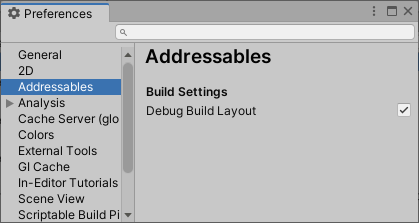

# Build layout report

The build layout report provides detailed information and statistics about your Addressables builds, including:

* Description of AssetBundles
* Sizes of each Asset and AssetBundle
* Explanation of non-Addressable Assets implicitly included in AssetBundles as dependencies. See [Asset and AssetBundle dependencies] for more information.
* [AssetBundle dependencies]

 When enabled, the Addressables build script creates the report whenever you build Addressables content. You can enable the report in the Addressables section of the [Preferences window]. You can find the report in your project folder at `Library/com.unity.addressables/buildlayout`. Producing the report does increase build time.

See [Building your Addressable content] for more information about building content.

## Creating a build report

To create a build report:

1. Enable the build report.
    1. Open the Unity Preferences window (menu: Edit > Preferences).
    2. Select __Addressables__ from the list of preference types.
    3. Check the __Debug Build Layout__ option.
       

2. Perform a full build of your Addressables content. (See [Builds] for more information.)
3. In a file system window, navigate to the `Library/com.unity.addressables/` folder of your Unity project.
4. Open the `buildlayout` file in a suitable text editor.

## Report data

A build layout report contains the following information:

* [Summary]\: provides an overview of the build
* [Group]: provides information for each group
* [Asset bundle]: provides information about each bundle built for a group
* [Asset]: provides information about each explicit asset in a bundle
* [File]: provides information about each serialized file in an AssetBundle archive
* [Built-in bundles]: provides information about bundles created for assets, such as the default shader, that are built into Unity

### Summary section

Provides a summary of the build.

| Name| Purpose |
|:---|:---| 
| Addressable Groups| The number of groups included in the build. |
| Explicit Assets Addressed| The number of Addressable assets in the build (this number doesn't include assets in the build that are referenced by an Addressable asset, but which aren't marked as Addressable). |
| Total Bundle| The number of AssetBundles created by the build, including how many contain Scene data. |
| Total Build Size| The combined size of all AssetBundles. |
| Total MonoScript Size| The size of serialized MonoBehaviour and SerializedObject instances. |
| Total AssetBundle Object Size|  |

### Group section

Reports how Addressables packed the assets in a group into AssetBundles.

| Name| Purpose |
|:---|:---| 
| Group summary| Name, number of bundles created for group, total size, and number of explicit assets built for the group. |
| Schemas| Schemas and settings for the group. |
| Asset bundles| See [AssetBundle information]. |

### AssetBundle information

Reports details for each AssetBundle built for a group.

| Name| Purpose |
|:---|:---| 
| File name| The file name of the AssetBundle. |
| Size|  |
| Compression| The compression setting used for the bundle. |
| Object size|  |
| Bundle Dependencies| The list of other AssetBundles the current bundle depends upon. These bundles are always loaded with the current bundle. |
| Expanded Bundle Dependencies|  |
| Explicit Assets| [Asset information] about Addressables included in the bundle. |
| Files| [File information] about the files in the AssetBundle archive. Scene bundles contain up to two files per Scene, non-Scene bundles contain only one file. |

### Asset information

Provides Information for each asset in the Explicit Assets section.

| Name| Purpose |
|:---|:---| 
| Asset path| The path to the asset in your project |
| Total Size|  |
| Size from Objects|  |
| Size from Streamed Data|  |
| File Index| The index of the file in the AssetBundle in which this asset is located. |
| Addressable Name| The address of the asset. |
| External References|  |
| Internal References|  |

### File information

Provides details about each serialized file in an AssetBundle archive

| Name| Purpose |
|:---|:---| 
| File summary| Index in file list, number and size of serialized MonoScripts in the file |
| File sections| A serialized file can have one or more of the following sections:   &#8226; No extension  &#8226; .resS  &#8226; .resource  &#8226; .sharedAssets |
| Data from Other Assets| Dependent assets referenced by assets in the file. |

### Built-in Bundles

Lists any bundles that Addressables created from assets, such as the default shaders, that are provided as part of the Unity Engine. The Addressables build places such assets in the separate bundles listed here when needed to avoid duplicating the assets across multiple bundles as implicit dependencies.

[Asset and AssetBundle dependencies]: xref:addressables-asset-dependencies
[Asset bundle]: #assetbundle-information
[Asset information]: #asset-information
[Asset]: #asset-information
[AssetBundle dependencies]: xref:AssetBundles-Dependencies
[AssetBundle information]: #assetbundle-information
[Build layout report]: #build-layout-report
[Build profile log]: #build-profiling
[Building your Addressable content]: xref:addressables-building-content
[Builds]: xref:addressables-builds
[Built-in bundles]: #built-in-bundles
[chrome://tracing]: chrome://tracing
[Chromium]: https://www.chromium.org/Home
[File]: #file-information
[File information]: #file-information
[Group]: #group-section
[Preferences window]: https://docs.unity3d.com/Manual/Preferences.html
[Summary]: #summary-section
[Trace Event Profiling Tool]: https://www.chromium.org/developers/how-tos/trace-event-profiling-tool
[Unity Scriptable Build Pipeline]: https://docs.unity3d.com/Packages/com.unity.scriptablebuildpipeline@latest